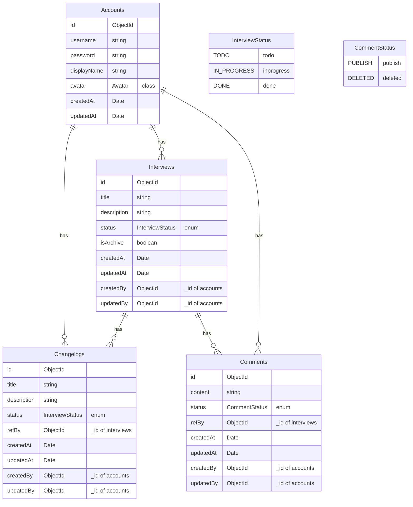

# Docs website

This site was built using [Documentations](https://nuza555xx.github.io/robinhood-assignment/).

# ER Diagram for Application

This diagram illustrates the relationships between key entities in application's data model.



# Tech Stacks

**NestJS**: A progressive Node.js framework for building efficient, reliable, and scalable server-side applications.

**Fastify**: A fast and low overhead web framework for Node.js, focused on providing a good developer experience without sacrificing performance.

**Mongoose**: An elegant MongoDB object modeling tool for Node.js. It provides a straight-forward, schema-based solution to model application data.

**MongoDB**: A NoSQL database that provides high performance, high availability, and easy scalability.

**Jest**: A delightful JavaScript Testing Framework with a focus on simplicity.

**Swagger**: A tool for API documentation, allowing developers to describe and document RESTful APIs.

## Installation

```bash
$ yarn install
```

## Building the App

```bash
# nest build
$ yarn run build

```

## Building the App using Docker

- [ ] Compile source code ./dict

```bash
# docker build
$ docker build -t backend:latest  -f Dockerfile .

```

## Docker Swarm Deployment

- [ ] Build the app to docker image

```bash
# database and service
$ docker-compose up -d

```

## Seeding Data

- [ ] Run docker swarm or mongodb container

```bash
# Run Docker Swarm or MongoDB container
$ docker exec -it -w /root mongodb /bin/bash

# Authenticate and connect to MongoDB
$ mongosh --host CONTAINER_NAME --port PORT --username USERNAME --password PASSWORD --authenticationDatabase admin TARGET_DB

# Seed example password $12345678Ab bypass
$ db.accounts.insertOne({ "username" : "example", "password" : "$2b$10$T9HWCVpTNwTG09UM0RtpuOnLnvdBQXo/Sla4av1Bl6AUdj9SwhXfC", "displayName" : "example example", "createdAt" : "SEED", "updatedAt" : "SEED" })

# Exit MongoDB
$ exit
```

## Running the App Locally

- [ ] Build the app to docker-compose

```bash
# development
$ yarn run start

# watch mode
$ yarn run start:dev

# production mode
$ yarn run start:prod
```

## Test

```bash
# unit tests
$ yarn run test

# e2e tests
$ yarn run test:e2e

# test coverage
$ yarn run test:cov
```
